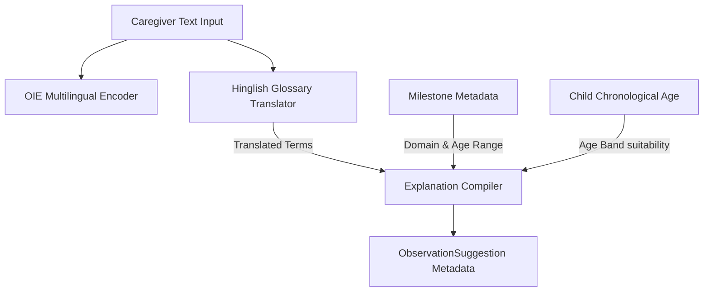

# Phase 6B Judge Evidence: Neurolens Validation Package

This document presents structural and empirical evidence compiled from the Neurolens repository for validation by visiting judges.

---

## 1. Core System & Data Benchmarks

### A. OIE Multilingual Model Accuracy
Empirical metrics calculated against the 160 labeled multilingual Hinglish validation observation dataset:
*   **Top-1 Milestone Accuracy**: **80.62%** (129 / 160 correct matches)
*   **Top-3 Milestone Accuracy**: **96.25%** (154 / 160 correct matches)
*   **Domain Accuracy**: **86.88%** (139 / 160 correct domains)

### B. Repository Dataset Sizes
*   **Total Milestones**: **80** (fully seeded across 5 developmental domains: Communication, Gross Motor, Fine Motor, Social Emotional, Cognitive, and Behavioral Patterns).
*   **Total Labeled Evaluation Dataset**: **160** observations with human-validated tags.

---

## 2. Telemetry & User Feedback Schema

Caregiver feedback is logged in the `suggestion_feedback` table:

```sql
CREATE TABLE suggestion_feedback (
    id UUID PRIMARY KEY,
    parent_id UUID NOT NULL REFERENCES parents(id) ON DELETE CASCADE,
    child_id UUID NOT NULL REFERENCES children(id) ON DELETE CASCADE,
    ai_suggestion_event_id UUID REFERENCES ai_suggestion_events(id) ON DELETE SET NULL,
    milestone_id UUID NOT NULL REFERENCES milestones(id) ON DELETE CASCADE,
    feedback_type VARCHAR(50) NOT NULL, -- 'helpful' or 'not_helpful'
    comment TEXT,
    created_at DATETIME NOT NULL
);
```

### Separated Analytics Contracts
1.  **Caregiver Stats (`GET /analytics/caregiver/{child_id}`)**:
    *   `suggestions_reviewed`: count of suggestion events.
    *   `helpful_votes`: count of helpful feedback tags.
    *   `total_feedback`: total feedback count.
2.  **Judge Analytics (`GET /analytics/judge`)**:
    *   Full benchmark metrics (Top-1, Top-3, Domain accuracy).
    *   Human Validation Study summaries (average scores).
    *   Global suggestion and feedback acceptance/utility counts.

---

## 3. Explainability Architecture

OIE explainability is derived dynamically from metadata parameters:



### Metadata Fields
*   `translated_terms`: List of glossary hits mapping Hinglish words (e.g. *"ishaara"*) to English translations (*"pointing"*).
*   `domain_name`: Domain categorizations.
*   `age_band_relevance`: Evaluations of age match boundaries.
*   `explanation_text`: Truthful summary combining the domain, suitability, and caregiver term translations.

---

## 4. Human-in-the-Loop Validation Study Framework

To support validation runs by researchers and judges, the database logs usability study session feedback:

```sql
CREATE TABLE human_validation_sessions (
    id UUID PRIMARY KEY,
    participant_id VARCHAR(100) NOT NULL,
    role VARCHAR(100) NOT NULL,
    usability_score INTEGER NOT NULL, -- 1-5 scale
    trust_score INTEGER NOT NULL,     -- 1-5 scale
    report_usefulness_score INTEGER NOT NULL, -- 1-5 scale
    comments TEXT,
    created_at DATETIME NOT NULL
);
```
Logged sessions feed the **Judge Metrics & Validation Portal** (`/judge` on frontend) to show usability metrics and support new test entries.
