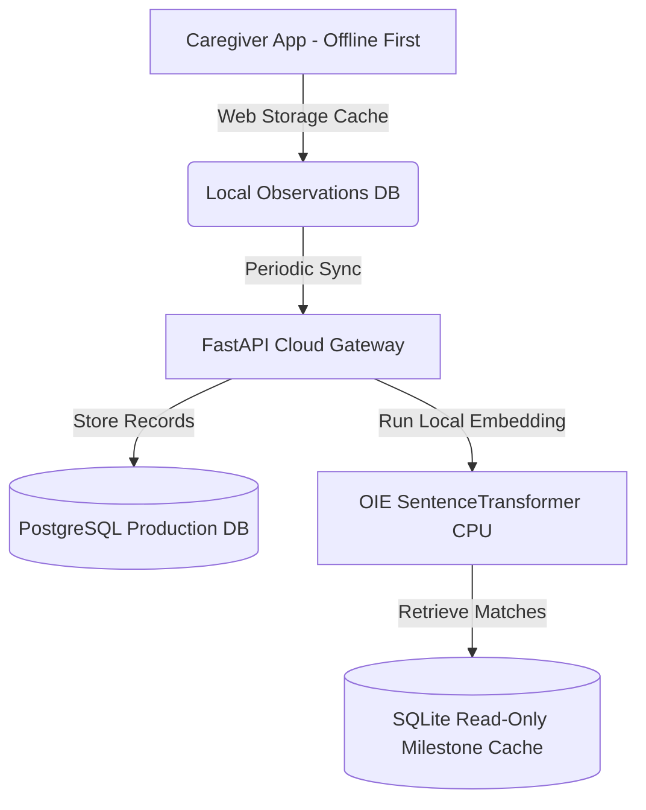

# Neurolens Sustainability & Scaling Plan

This document details the financial sustainability model, architecture hosting cost estimates, long-term maintenance requirements, and scaling pathways for Neurolens.

---

## 💰 1. Hosting & Operational Cost Estimates

A major advantage of Neurolens' architecture is the **local execution of the Observation Intelligence Engine (OIE)**. By running embeddings and classification locally inside the container environment using CPU-optimized sentence-transformers, the platform incurs zero third-party AI API costs (such as OpenAI, Gemini, or Pinecone).

### Local/Clinical Clinic Server Deployment (Zero Cloud Cost)
*   **Target Environment**: Local PC or clinic workstation.
*   **Operating Cost**: $0/month.
*   **Infrastructure**: Runs as containerized service via Docker Compose directly on clinician or community health worker hardware.

### Cloud Deployment (Small to Mid-Scale Pilot)
For a pilot deployment:

| Service Component | Cloud Provider Alternative (AWS/GCP/Render) | Purpose | Monthly Cost (Est.) |
| :--- | :--- | :--- | :--- |
| **Backend API** | AWS ECS Fargate (1 vCPU, 2GB RAM) | Runs FastAPI container + SentenceTransformer (CPU execution) | ~$30.00 |
| **Frontend App** | Vercel (Hobby/Pro Plan) or Netlify | Hosts static Next.js pages & serverless router | $0.00 - $20.00 |
| **Database** | AWS RDS PostgreSQL (db.t4g.micro) | Persistent relational parent, child, and observation storage | ~$15.00 |
| **Storage (Reports)** | AWS S3 (Standard Storage, 50GB) | PDF/JSON compiled report archives | ~$1.25 |
| **Total Estimated Cost** | | | **~$46.25 - $66.25** |

### Cost Estimation Assumptions
All calculations are **`[ESTIMATED]`** based on the following usage bounds:
*   **Active Registered Cohort**: 10,000 registered caregiver profiles.
*   **Concurrency limits**: Up to 500 concurrent active parent sessions.
*   **Local Inference load**: OIE queries execute on CPU inside the Fargate backend tasks, requiring no paid external vector indexing systems.
*   **Report Generation frequency**: Average caregiver compiles a clinician report 1.5 times per year (aligning with pediatric checkup cycles).

---

## 🚀 2. Future Scale & Architecture Scaling Roadmap

As user volume scales, Neurolens implements a hybrid offloading model to keep cloud operational costs minimal and highly sustainable:

1.  **Stage 1: Offline-First Client Staging (`[PLANNED]`)**
    *   Leverage client-side `localStorage` to cache caregiver observations locally.
    *   Sync to the backend server only when compiling clinician reports.
2.  **Stage 2: Hybrid Client-Side OIE Inference (`[PLANNED]`)**
    *   Compile the sentence-transformer (`paraphrase-multilingual-MiniLM-L12-v2`) to ONNX format.
    *   Deliver embedding inference directly in the caregiver's browser using `@xenova/transformers` (Transformers.js).
    *   **Result**: CPU inference offloaded entirely to client devices, reducing server infrastructure costs to simple database CRUD traffic.

---

## 🤝 3. Community Adoption & Pilot Pathway

To drive real-world adoption, Neurolens leverages a multi-step partner integration pipeline:

### Phase 1: Pediatric Clinic Co-Design (`[PLANNED]` 1 - 3 Months)
*   **Objective**: Validate clinician readiness report layouts with 2-3 local pediatric clinics.
*   **Focus**: Measure clinician preparation reduction and track UI trust ratings.

### Phase 2: Community Early Intervention Pilots (`[PLANNED]` 3 - 6 Months)
*   **Objective**: Deploy Neurolens inside local child development centers or speech therapy clinics.
*   **Caregiver Engagement**: Focus on multilingual observation capture (Hinglish/English mix) to expand pre-diagnostic validation data.

### Phase 3: Open-Source Core Maintenance (`[PLANNED]` 6+ Months)
*   **Objective**: Release the milestone mapping catalog and OIE indexing engine as an open-source library.
*   **Sustainment**: Allow developmental researchers to update the underlying milestone guidelines dynamically through public PR reviews.
