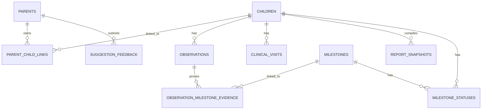

# Neurolens System Architecture

This document describes the design, components, and integration parameters of the Neurolens system.

---

## 👁️ 1. Product Overview
Neurolens is an **evidence-first developmental observation platform** designed to help caregivers record observations, track milestone progress, and compile structured context reports to prepare for clinician visits. It acts as an information organizer, structurally avoiding diagnostic calculations.

---

## 🎨 2. Frontend Architecture
*   **Framework**: Next.js 16 (React, TypeScript) `[VERIFIED]`
*   **Key Pages**:
    *   `/` (Landing page featuring problem statement, OIE badges, and safety disclaimer)
    *   `/dashboard` (OIE suggestion overview, concern counts, and caregiver trust panel)
    *   `/observations` (Observation logging, timeline, and AI analysis interface)
    *   `/milestones` (Milestone progress checklists and evidence coverage indicators)
    *   `/report` (Clinician-ready compiled reports with print/PDF CSS layout overrides)
    *   `/judge` (Judge metrics panel showing role-split feedback and OIE scores)
*   **Session Management**: `ActiveChildContext` persistent local storage synchronizes active child selections.
*   **Authentication Flow**: Implemented via JWT headers. User routes fetch access tokens from `/auth/login` and append them to requests.

---

## ⚙️ 3. Backend Architecture
*   **Framework**: FastAPI (Python) `[VERIFIED]`
*   **Key Modules**:
    *   `auth`: Handles parent credentials, hashing, and token issuance.
    *   `children`: Processes child profile additions, editing, and archiving.
    *   `observations`: Manages observation CRUD, soft deletion, and filtering.
    *   `milestones`: Handles checklist states and evidence linkages.
    *   `ai`: Evaluates observations and returns OIE milestone suggestions.
    *   `feedback` & `validation`: Persists ratings and scores.
    *   `reports`: Assembles immutable JSON clinician reports.

---

## 🗄️ 4. Relational Database Schema
*   **ORM**: SQLAlchemy with SQLite (development/tests) and PostgreSQL (production).
*   **Key Relationships**:

---

## 🧠 5. AI Layer (Observation Intelligence Engine)

OIE is a **local, retrieval-based search model** that matches free-form caregiver observations to standard developmental milestones.

*   **Embedding Model**: `paraphrase-multilingual-MiniLM-L12-v2` `[VERIFIED]`
*   **Knowledge Base**: 85 standard milestones `[VERIFIED]`
*   **Evaluation Dataset**: 160 labeled observations `[VERIFIED]`
*   **OIE Benchmark Scores**:
    *   *Top-1 Milestone Accuracy*: **80.62%** `[VERIFIED]`
    *   *Top-3 Milestone Accuracy*: **96.25%** `[VERIFIED]`
    *   *Domain Classification Accuracy*: **86.88%** `[VERIFIED]`
*   **Ranking Calculations**: Vector cosine similarities are computed via dot product, adjusted by an age-band weight mapping linear decays for children older or younger than target ranges.

---

## 👥 6. Human Validation & Feedback Loops
*   **Suggestion Feedback**: The `suggestion_feedback` table persists caregivers' 👍/👎 ratings and comments.
*   **Validation Stats API**: The `human_validation_sessions` table aggregates usability, trust, and usefulness scores. Seeded records constitute a **demonstration validation dataset** split by Caregiver (N=14) and Clinician (N=5) roles.

---

## 📊 7. Immutable Reporting & Provenance Traceability
*   **Immutable Snapshots**: Reports are compiled into a separate table, storing observations as static text fields. If observations are modified later, generated report data remains frozen.
*   **Provenance Links**: The junction table `observation_milestone_evidence` establishes concrete links between observations and milestones, allowing clinicians to trace milestone recommendations back to parent observations.

---

## 🛡️ 8. Responsible AI Guardrails
*   **Non-Diagnostic Boundaries**: Mapped directly in [responsible_ai.md](file:///d:/Desktop/New_Autism/docs/responsible_ai.md). The backend contains zero classifier logic for autism, zero probability scoring, and zero automated clinical advice.
*   **Compliance Banners**: Renders notice disclaimers across all caregiver-facing screens and printed reports warning that Neurolens does not replace pediatrician evaluations.
